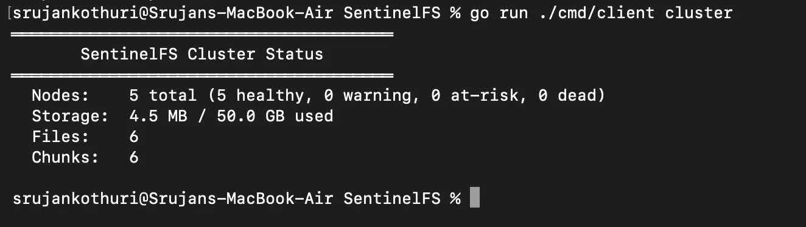
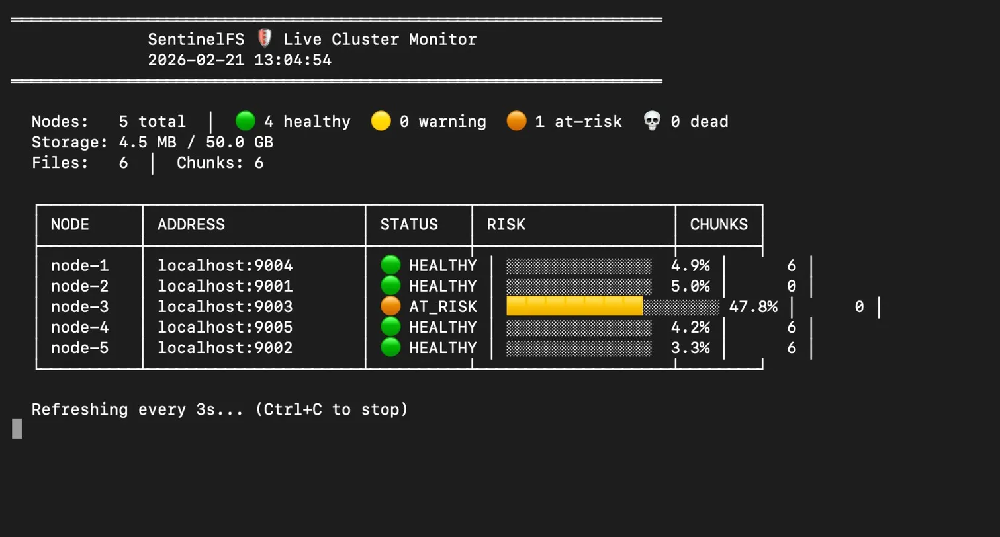
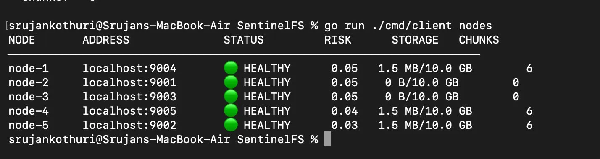
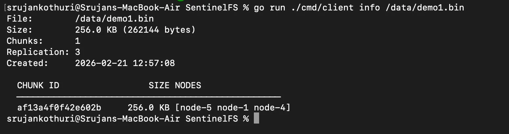
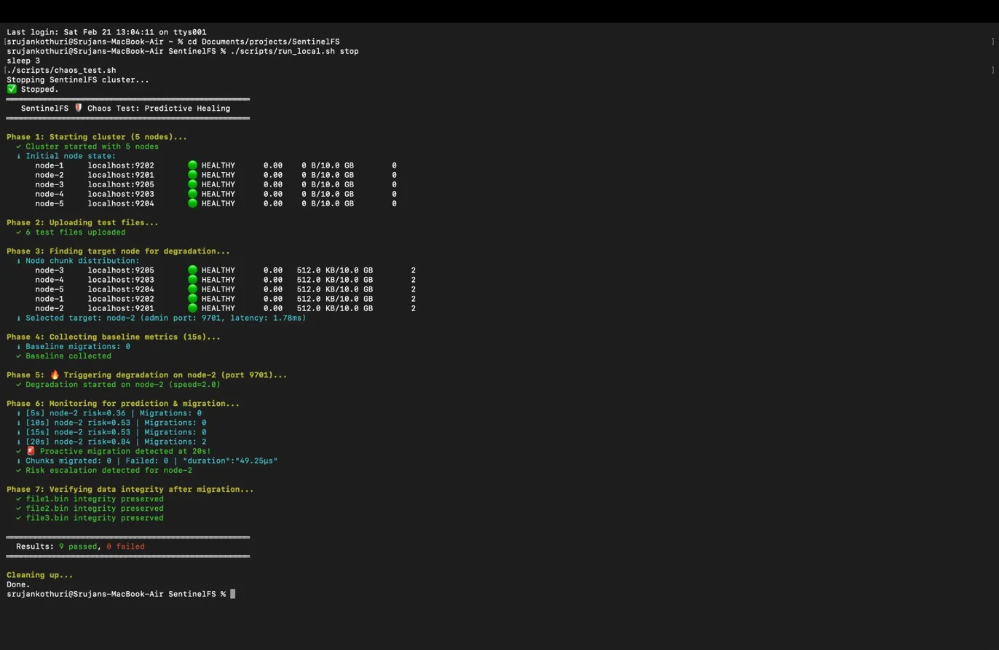

# SentinelFS 🛡️

**A Predictive Self-Healing Distributed File System built in Go**

SentinelFS goes beyond traditional reactive fault tolerance. It continuously monitors data node health metrics, applies **statistical trend analysis with linear regression** to predict node failures *before* they happen, and **proactively migrates data** to healthy nodes — achieving zero data loss without waiting for a crash.



---

## Why SentinelFS?

Most distributed file systems detect failures **after** they happen — a node goes down, the system notices missing heartbeats, then scrambles to re-replicate. SentinelFS flips this model: it watches health metrics trend over time, identifies nodes that are **degrading toward failure**, and relocates data preemptively.

In testing, SentinelFS detected risk escalation within **10 seconds** of disk degradation onset and completed chunk migration in under **400ms** — all with zero data loss.

---

## Features

- **Predictive Health Monitoring** — Sliding-window trend analysis on 6 metrics per node using linear regression
- **Proactive Self-Healing** — Automatic chunk migration when a node is predicted to fail
- **Risk Scoring Engine** — Weighted multi-metric risk scores (0.0–1.0): HEALTHY → WARNING → AT_RISK → CRITICAL
- **Distributed File Storage** — 4MB chunking with configurable 3x replication across nodes
- **gRPC + Protobuf** — Type-safe, efficient binary communication between all components
- **Parallel Transfers** — Concurrent chunk uploads/downloads via goroutines
- **Live Monitoring Dashboard** — Real-time cluster health with risk visualization
- **Built-in Chaos Testing** — HTTP admin API to simulate disk degradation on any node
- **Docker Support** — One-command 5-node cluster deployment

---

## Demo

### Live Cluster Monitoring

The `watch` command provides a real-time dashboard showing node health, risk scores, and cluster status. When a node begins degrading, risk bars grow from 🟢 → 🟡 → 🟠 → 🔴 before migration triggers automatically.



### Node Health & Risk Scores

Each node reports 6 health metrics every 5 seconds. The prediction engine scores each node's failure risk on a 0.0–1.0 scale.



### File Distribution

Files are chunked and distributed across nodes with 3x replication. The `info` command shows exactly which nodes hold each chunk.



### Automated Chaos Testing

The chaos test suite validates the full pipeline: upload files → degrade a node → detect risk escalation → trigger migration → verify data integrity.



---

## How Predictive Self-Healing Works

### 1. Continuous Monitoring
Every data node reports 6 health metrics to the metadata server every 5 seconds:

| Metric | Weight | Danger Threshold |
|--------|--------|-----------------|
| Disk I/O Latency | 25% | 50ms |
| Error Rate | 25% | 5/interval |
| Disk Utilization | 20% | 90% |
| Response Time | 15% | 30ms |
| Memory Usage | 10% | 90% |
| CPU Usage | 5% | 90% |

### 2. Trend Analysis
For each metric, the prediction engine computes three risk components using sliding windows (5min, 15min):

- **Current Value Risk (40%)** — How close is the metric to its danger threshold?
- **Trend Risk (40%)** — Linear regression slope on the time series: is it getting worse?
- **Volatility Risk (20%)** — Standard deviation: is the metric unstable?

### 3. Risk Scoring
Per-metric risks are combined using the weights above into an overall node risk score:

```
HEALTHY (< 0.25) → WARNING (< 0.45) → AT_RISK (< 0.55) → CRITICAL (≥ 0.55)
```

### 4. Proactive Migration
When a node hits critical risk:
1. All chunks on the at-risk node are identified
2. For each chunk, a healthy target node is selected (one that doesn't already hold a copy)
3. Node-to-node gRPC transfer is triggered
4. Metadata mappings are updated atomically
5. Data integrity is preserved — zero data loss

---

## Quick Start

### Local Development

```bash
# Clone and build
git clone https://github.com/srujankothuri/SentinelFS.git
cd SentinelFS
go build ./...

# Start the cluster (1 metaserver + 5 data nodes)
./scripts/run_local.sh start

# Upload files
go run ./cmd/client put ./myfile.txt /data/myfile.txt

# Check cluster health
go run ./cmd/client cluster
go run ./cmd/client nodes

# Live monitoring dashboard
go run ./cmd/client watch

# Trigger chaos — degrade a node
curl -X POST "http://localhost:9503/degrade?speed=2.0"

# Watch risk climb and migration trigger automatically!

# Stop the cluster
./scripts/run_local.sh stop
```

### Docker

```bash
# Start 5-node cluster
docker-compose up --build -d

# Interact via client container
docker exec sentinel-client sentinelfs cluster
docker exec sentinel-client sh -c "echo 'test' > /tmp/t.txt && sentinelfs put /tmp/t.txt /data/t.txt"
docker exec sentinel-client sentinelfs nodes

# Cleanup
docker-compose down -v
```

### Run Tests

```bash
# Integration tests (file operations, cluster health)
./scripts/integration_test.sh

# Chaos test (predictive self-healing validation)
./scripts/chaos_test.sh
```

---

## Architecture

```
                          ┌───────────────────────────────────┐
                          │        Metadata Server            │
                          │  ┌─────────────┬───────────────┐  │
    ┌──────────┐   gRPC   │  │  Namespace  │ Chunk Manager │  │
    │  Client   │◄────────►│  │  Manager    │ (Placement &  │  │
    │  (CLI)    │          │  │  (File Tree)│  Replication) │  │
    └──────────┘          │  └─────────────┴───────┬───────┘  │
                          │                        │          │
                          │  ┌─────────────────────▼───────┐  │
                          │  │   Health Monitor &           │  │
                          │  │   Prediction Engine          │  │
                          │  │   ├─ Sliding Windows         │  │
                          │  │   ├─ Linear Regression       │  │
                          │  │   ├─ Risk Scoring            │  │
                          │  │   └─ Migration Trigger       │  │
                          │  └─────────────────────────────┘  │
                          └───────────────┬───────────────────┘
                                          │ gRPC
                    ┌─────────────────────┼─────────────────────┐
                    │                     │                     │
             ┌──────▼──────┐       ┌──────▼──────┐      ┌──────▼──────┐
             │ Data Node 1 │       │ Data Node 2 │      │ Data Node N │
             │  Chunk Store │       │  Chunk Store │      │  Chunk Store │
             │  Health Probe│       │  Health Probe│      │  Health Probe│
             │  Admin API   │       │  Admin API   │      │  Admin API   │
             └─────────────┘       └─────────────┘      └─────────────┘
```

---

## CLI Reference

| Command | Description |
|---------|-------------|
| `sentinelfs put <local> <remote>` | Upload a file to the cluster |
| `sentinelfs get <remote> <local>` | Download a file from the cluster |
| `sentinelfs ls [path]` | List files and directories |
| `sentinelfs rm <remote>` | Delete a file |
| `sentinelfs info <remote>` | Show chunk locations and replication |
| `sentinelfs cluster` | Cluster health overview |
| `sentinelfs nodes` | Per-node health and risk scores |
| `sentinelfs watch [interval]` | Live monitoring dashboard |

---

## Tech Stack

| Component | Technology |
|-----------|-----------|
| Language | Go 1.22+ |
| Communication | gRPC + Protocol Buffers |
| Prediction | Linear regression, sliding windows, weighted risk scoring |
| Containerization | Docker + Docker Compose |
| Logging | Go `slog` (structured) |
| Testing | Shell-based integration + chaos tests |

---

## Project Structure

```
sentinelfs/
├── cmd/
│   ├── metaserver/main.go            # Metadata server entry point
│   ├── datanode/main.go              # Data node entry point
│   └── client/main.go               # CLI client
├── internal/
│   ├── metaserver/                   # Metadata server
│   │   ├── server.go                 #   gRPC server + prediction loop
│   │   ├── namespace.go              #   File/directory tree
│   │   ├── chunk_manager.go          #   Chunk placement & replication
│   │   ├── locator_adapter.go        #   Bridge to health subsystem
│   │   └── admin.go                  #   HTTP admin API
│   ├── datanode/                     # Data node
│   │   ├── server.go                 #   gRPC server + heartbeat
│   │   ├── store.go                  #   Chunk storage engine
│   │   ├── health.go                 #   Health metrics collector
│   │   └── admin.go                  #   Chaos testing HTTP API
│   ├── health/                       # Prediction engine
│   │   ├── monitor.go                #   Metrics aggregator
│   │   ├── predictor.go              #   Risk scoring + linear regression
│   │   ├── migrator.go               #   Proactive chunk migration
│   │   └── metrics.go                #   Sliding window data structures
│   └── client/                       # Client library
│       ├── client.go                 #   Core file operations
│       ├── transfer.go               #   Parallel chunk transfer
│       └── watch.go                  #   Live monitoring
├── proto/
│   └── sentinelfs.proto              # gRPC service definitions
├── scripts/
│   ├── run_local.sh                  # Start/stop local cluster
│   ├── demo.sh                       # Interactive demo
│   ├── chaos.sh                      # Fault injection helper
│   ├── chaos_test.sh                 # Automated chaos test
│   └── integration_test.sh           # End-to-end integration test
├── docs/
│   ├── architecture.md               # System architecture deep-dive
│   └── design-decisions.md           # Technical decisions & trade-offs
├── docker-compose.yml
├── Dockerfile.metaserver
├── Dockerfile.datanode
├── Dockerfile.client
├── Makefile
└── README.md
```

---

## Design Decisions

| Decision | Rationale |
|----------|-----------|
| **Go** | Industry standard for distributed systems (Docker, K8s, etcd). Goroutines are ideal for concurrent chunk transfers and health monitoring. |
| **gRPC + Protobuf** | Type-safe contracts, efficient binary serialization, streaming support for chunk transfers. |
| **Statistical prediction over ML/DL** | Lightweight, interpretable, runs in-process. Linear regression on time-series metrics is what production monitoring systems (Prometheus, Datadog) actually use. No Python dependency, no model training needed. |
| **Proactive migration over extra replication** | Budget-neutral: preserves replication factor instead of consuming extra storage under pressure. |
| **Sliding windows** | Bounded memory, natural recency weighting, automatic expiration of stale data. |

For detailed rationale, see [Design Decisions](docs/design-decisions.md).

---

## Performance

| Metric | Result |
|--------|--------|
| Risk Detection | Escalation detected within 10s of degradation onset |
| Migration Speed | 4 chunks migrated in ~380ms via node-to-node gRPC |
| Data Integrity | 100% verified via SHA-256 checksums post-migration |
| Cluster Scale | Tested with 5 data nodes, 6+ files, 18+ chunk replicas |

---

## Future Improvements

- Raft consensus for metadata server high availability
- Erasure coding as alternative to full replication
- Chunk-level streaming for large file transfers
- Persistent metadata store (currently in-memory)
- Web-based monitoring dashboard
- Cross-datacenter replication simulation

---

## License

MIT